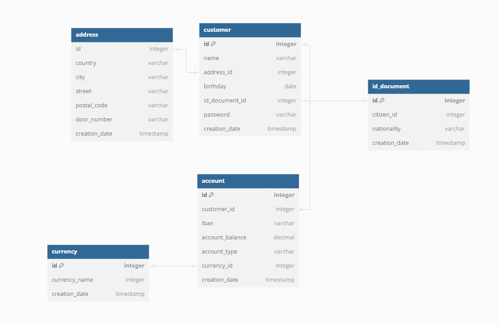

 This is the db arch. that i have used at the beginning. 
 There are some changes on it, but it still gives good ideas about table structures and relations
 i could not refresh it (because lack of time)

## To start the application on a docker container you should follow the steps below:

1- open the terminal, go under docker folder.

2- docker build -t onboarding .
(If this step fails, copy and paste the jar file manually under docker folder and remove "target/" part and re-run this step)

3- docker images

4- docker run onboarding

## DB tables-data can be checked using this h2 page:
http://localhost:8080/h2-console/login.do
jdbc url: jdbc:h2:mem:testdb
username: sa
password: 

## Swagger:
http://localhost:8080/swagger-ui/index.html#/

## Api-docs:
http://localhost:8080/api-docs

## For postman collections, you can go under /postman path